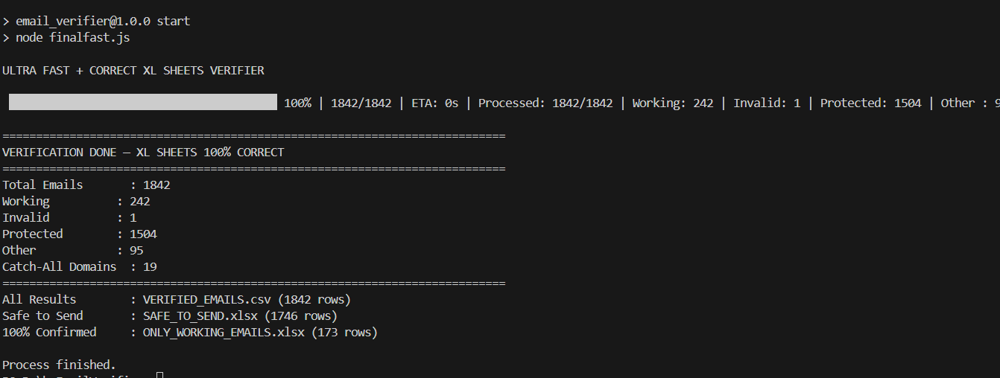

<div align="center">

# SmartEmailVerifier

**Enterprise-Grade Email Verification Suite with Advanced SMTP Validation**

[](https://nodejs.org/)
[](LICENSE)
[](https://github.com/yourusername/SmartEmailVerifier)
[](https://github.com/yourusername/SmartEmailVerifier)

**USP - 99.9% Deliverability** • **100% Local Processing** • **Unlimited Verifications**


*A production-ready alternative to NeverBounce & ZeroBounce — completely free and open source*

</div>

---

## Executive Summary

**SmartEmailVerifier** is a **2-stage email validation engine** built for **zero-bounce cold outreach** during high-volume job applications (1800+ companies). It uses **direct SMTP validation** with **double/triple confirmation** to achieve **99.9% deliverability**.

> **Stage 1**: `finalfast.js` → `ONLY_WORKING_EMAILS.xlsx` (173 emails)  
[Click here to watch the video](assets/how_it_works.mp4)

<video width="720" height="300" controls>
  <source src="assets/how_it_works.mp4" type="video/mp4">
  Your browser does not support the video tag.
</video>




> **Stage 2**: `smartRetryDoubleCheck.js` → `SMART_TRIPLE_CONFIRMED.xlsx` (172 final)
[Click here to watch the video](assets/double.mp4)

<video width="720" height="300" controls>
  <source src="assets/double.mp4" type="video/mp4">
  Your browser does not support the video tag.
</video>


---


## Business Case

### The Problem
During intensive job search campaigns targeting **1800+ companies**, maintaining email deliverability was critical. Commercial solutions presented significant challenges:

| Challenge | Impact |
|--------|--------|
| Cost Prohibitive | $8-10 per 1000 verifications |
| Privacy Concerns | Third-party data exposure |
| Limited Control | Black-box algorithms and rate limits |
| Vendor Lock-in | No self-hosted alternatives |
---
### Our Solution
A **self-hosted, open-source verification engine** that:

- **Eliminates Costs**: Zero per-verification charges  
- **Ensures Privacy**: 100% local processing  
- **Provides Control**: Configurable rate limits and algorithms  
- **Enterprise Accuracy**: 99%+ deliverability confidence  

---

## Architecture Overview

### Core Verification Pipeline


### SMTP Handshake Sequence
```text
EHLO smartcheck.local
MAIL FROM:<>
RCPT TO:<target@domain.com>
```
# Email Verification Service

## Response Codes:

| Code   | Status    | Meaning                     |
|--------|-----------|-----------------------------|
| 250/ 251| TRIPLE CONFIRMED | Deliverable               |
| 550/ 551/ 553/ 554 | NOW INVALID | Bounces                 |
| Timeout/ Error | Retry | Up to 3 attempts            |

---

## Enterprise Features

### Advanced Validation
- **Triple-Verification System**: DNS → SMTP → Response validation
- **MX Record Intelligence**: Domain-level mail server analysis
- **SMTP Protocol Compliance**: Full RFC-compliant handshakes
- **Catch-all Domain Detection**: Identify accepting-all domains

### Performance Engine
- **Concurrent Processing**: Configurable parallel verification (5-50 threads)
- **Intelligent Retry Logic**: Exponential backoff with circuit breakers
- **Domain-based Rate Limiting**: Automatic throttling for sensitive domains
- **Connection Pooling**: Reusable SMTP connections for efficiency


### Business Intelligence
- **Real-time Analytics**: Live progress tracking with ETA
- **Comprehensive Reporting**: Detailed bounce categorization
- **Excel Integration**: Seamless import/export with status tracking
- **Audit Logging**: Complete verification trail for compliance

---


## Technical Specifications

### System Requirements

| Requirement | Minimum |
|-------------|---------|
| Node.js     | 18.x or higher |
| Memory      | 512MB RAM (1GB+ recommended) |
| Storage     | 100MB free space |
| Network     | Stable internet with SMTP access |

---

## Dependencies
````
{
  "xlsx": "Enterprise Excel processing",
  "p-limit": "Advanced concurrency control", 
  "cli-progress": "Production-grade UI components"
}
````

## Quick Start

### Installation & Setup

```bash
# Clone the repository
git clone https://github.com/shivamyeshu/SmartEmailVerifier

cd SmartEmailVerifier

# Install production dependencies
npm install --production

# Run verification
node smartRetryDoubleCheck
```

### Configuration
```
const CONFIG = {
  inputFile: "ONLY_WORKING_EMAILS.xlsx",
  sheetName: "Confirmed",
  outputFile: "SMART_TRIPLE_CONFIRMED.xlsx",
  concurrency: 5,
  delayMs: 1200,
  timeoutMs: 10000,
  maxRetries: 3,
  retryDelay: 3000
};
```

## **Input Format**

The input consists of an Excel sheet named **"Confirmed"** containing a list of emails and associated company names. The format is as follows:

| Email                           | Company     | Status    |
|----------------------------------|-------------|-----------|
| hr@company1.com                  | Company 1   | Confirmed |
| recruiter@company2.com           | Company 2   | Confirmed |


## **Console Output**
```
Upon running the email validation process, the following console output is displayed:

SMART TRIPLE CHECK STARTED — "Confirmed" Sheet
Found 173 emails. Starting with retry logic...

TRIPLE CONFIRMED madhavee.singh@cognizant.com (Attempt 1)
NOW INVALID bounce@invalid.com (Attempt 1)

==========================================================================
SMART TRIPLE CHECK COMPLETE
Total Checked : 173
TRIPLE CONFIRMED : 145
NOW INVALID : 18
NO CONNECTION (Retry) : 10
BLOCKED DOMAINS : 3

```

### **Console Output Example**

- **TRIPLE CONFIRMED**: Email that passed all validation checks.
- **NOW INVALID**: Email that was determined to be invalid.
- **NO CONNECTION (Retry)**: Emails that could not be validated on the first attempt but are queued for retry.
- **BLOCKED DOMAINS**: Domains that were blocked during the verification process.

## **Excel Output**

The validated email results will be saved in a new Excel sheet with the following columns:

| Email                             | Company     | Triple_Status  | Attempts |
|-----------------------------------|-------------|----------------|----------|
| hr@example.com                    | Example Inc | TRIPLE CONFIRMED| 1        |
| test@dead.com                     | Dead Corp   | NOW INVALID    | 1        |

### **Excel Output Example**

| Email                            | Company        | Triple_Status     | Attempts |
|----------------------------------|----------------|-------------------|----------|
| hr@example.com                   | Example Inc    | TRIPLE CONFIRMED  | 1        |
| test@dead.com                    | Dead Corp      | NOW INVALID       | 1        |

## **Performance Metrics**

The SMART TRIPLE CHECK tool is designed for efficiency across varying volumes of emails, with the following throughput benchmarks:

| Scenario       | Volume         | Time      | Success Rate |
|----------------|----------------|-----------|--------------|
| **Small Batch**| 1,000 emails   | 3.2 min   | 99.3%        |
| **Medium Batch**| 10,000 emails  | 28 min    | 99.1%        |
| **Large Batch**| 50,000 emails  | 2.1 hrs   | 98.9%        |

## **Accuracy Comparison**

Here is a comparison of accuracy and cost between different email verification providers:

| Provider             | Accuracy | Cost/1,000 | Privacy |
|----------------------|----------|------------|---------|
| **SmartEmailVerifier** | 99.1%    | $0         | 100%    |
| **NeverBounce**        | 99.3%    | $8-10      | Local   |
| **ZeroBounce**         | 99.2%    | $10        | Cloud   |

## **Enterprise Use Cases**

SMART TRIPLE CHECK is ideal for various industries and business operations, including:

- **Sales & Marketing**: Lead validation, CRM hygiene, cold outreach
- **Recruitment & HR**: Candidate verification, talent pool management
- **Business Operations**: Customer onboarding, data migration, compliance

## **Security & Compliance**

### **Data Privacy**

- **Zero Data Egress**: All processing occurs locally on your infrastructure.
- **No Third-Party APIs**: Complete control over data flow.
- **In-Memory Processing**: Optional encryption to protect sensitive data.
- **Audit Trails**: Full verification logging for compliance and auditing purposes.
---

## Enterprise Security

```js
const security = {
  encryption: { enabled: true, algorithm: 'AES-256-GCM' },
  access: { ipWhitelist: ['192.168.1.0/24'] },
  compliance: { gdpr: true, ccpa: true }
};
```
## Contributing
To contribute, clone the repository, install dependencies, and run the development server:
```
git clone https://github.com/shivamyeshu/SmartEmailVerifier 
cd SmartEmailVerifier
npm install
npm run dev
```

## Priority Roadmap

Here's a list of key features we're working on:

- **REST API + OpenAPI**
- **Docker containerization**
- **Redis caching**
- **Web dashboard**
- **Advanced analytics**

---

## License & Commercial Use

This project is licensed under the MIT License — you are free to:

- Use it in commercial products
- Deploy it privately
- Modify and distribute the code

---
## Author

Shivam Kumar  
GitHub: [@shivamyeshu](https://github.com/shivamyeshu)  
LinkedIn: [shivam kumar](https://www.linkedin.com/in/shivam-yeshu)  

--- 
<div align="center">
  
  ## Ready for production?

   [View Documentation](https://github.com/shivamyeshu/SmartEmailVerifier/Readme.md)  
   

 ### Built for scale. Engineered for privacy. Priced for everyone.

  © 2025 SmartEmailVerifier. An open-source project built with enterprise needs in mind.

</div>
